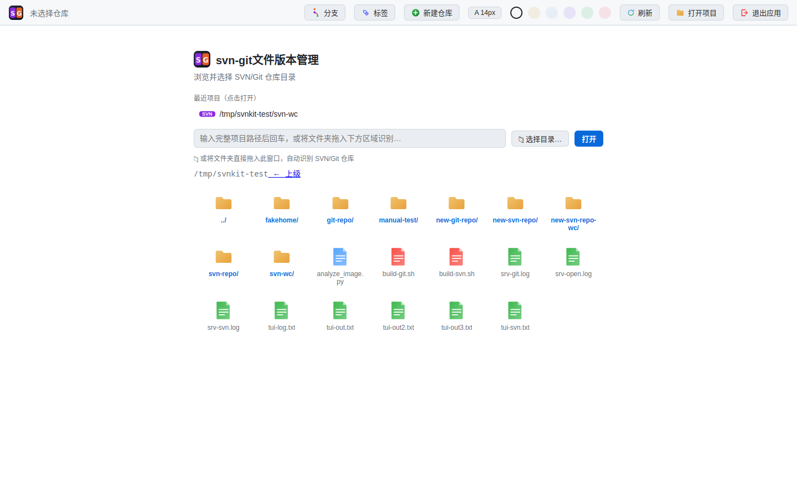
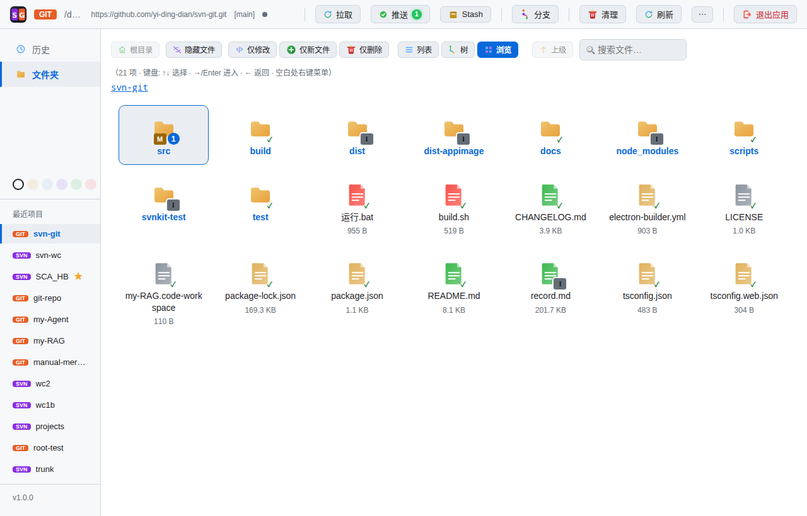
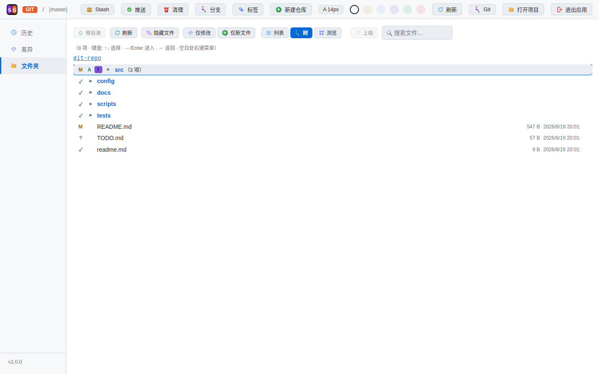
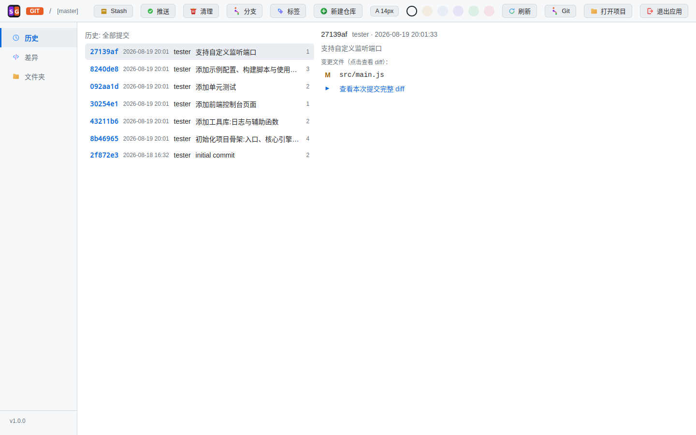
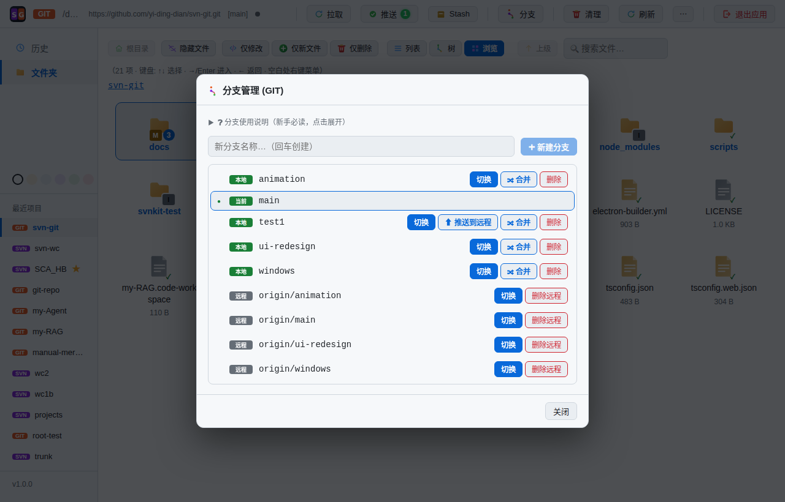
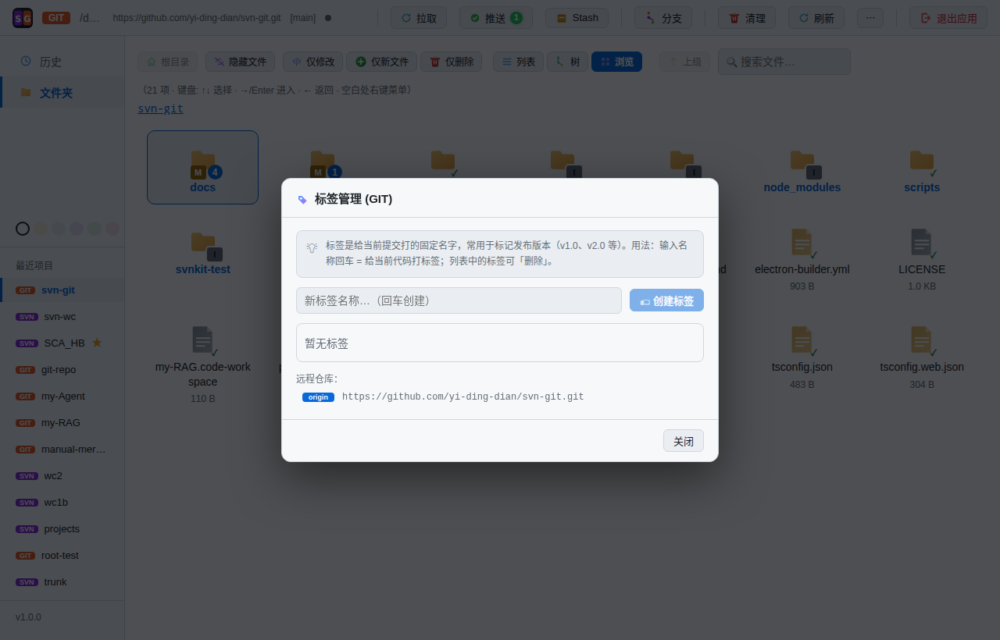
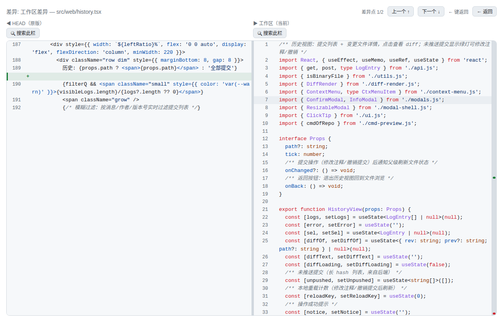
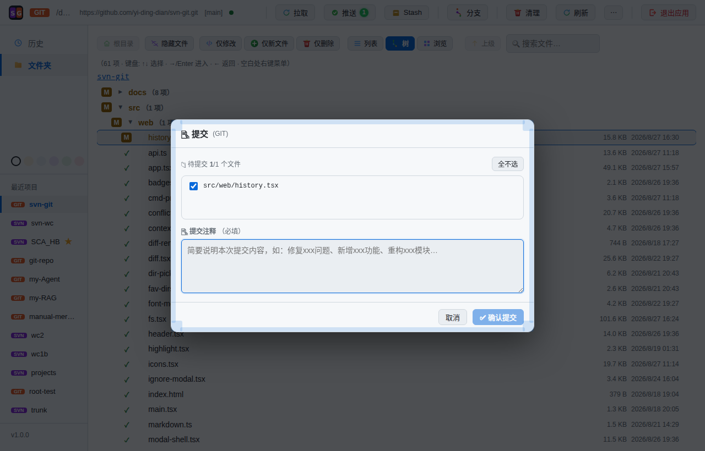

# svn-git 文件版本管理

> **SVN / Git 双引擎图形化版本管理工具**:浏览器界面、行级冲突防护,一套工具统一管理两种版本库。


在 Linux 桌面上同时使用 SVN 和 Git 的项目团队,不用再装两套 GUI 客户端。本工具提供状态检测、历史记录、并排差异对比、分支/标签/Stash、文件夹浏览,以及行业内少见的**行级冲突检测 + 提交拦截 + 三方冲突解决**完整防护闭环。

- 详细使用教程: [Git 使用说明](docs/usage-git.md) · [SVN 使用说明](docs/usage-svn.md)
- 架构设计: [docs/architecture.md](docs/architecture.md) · 项目优势: [docs/advantages.md](docs/advantages.md)

---

## 🚀 快速开始

### 方式一:AppImage(推荐,免装 Node、免装浏览器)

下载 `svn-git文件版本管理-1.0.0.AppImage` 后:

```bash
chmod +x ./svn-git文件版本管理-1.0.0.AppImage   # 首次需要执行权限
./svn-git文件版本管理-1.0.0.AppImage            # 直接运行
./svn-git文件版本管理-1.0.0.AppImage /path/to/repo   # 指定仓库目录启动
```

默认启动后弹出**应用窗口**(内置 Electron 渲染引擎,不依赖系统浏览器);关闭窗口即退出。

**使用系统浏览器**:加 `--browser` 参数改用浏览器标签操作:

```bash
./svn-git文件版本管理-1.0.0.AppImage --browser
```

此时服务在后台运行,用页面右上角「退出」停止。

> 环境要求:
> - 系统需安装 `svn` 和 `git` 命令(工具启动时自动检测,缺失时引导安装)
> - AppImage 依赖 FUSE;无法挂载时用 `--appimage-extract-and-run` 运行

### 方式二:源码运行

```bash
npm install
npm run dev            # 开发模式(热更新,用浏览器访问)
npm run dist:linux     # 打包 AppImage
```

### Windows

Windows 安装包(`.exe`)由 GitHub Actions 在 tag 发布时自动构建(见 `.github/workflows/release.yml`),也可在本地 Windows 执行 `npm run dist:win`。Windows 前置:安装 [TortoiseSVN](https://tortoisesvn.net/) 时**必须勾选 `command line client tools`**(默认不勾选,勾选后才有 svn.exe 并加入 PATH)和 [Git for Windows](https://git-scm.com/)。

---

## ✨ 功能预览

| 打开项目(目录浏览) | 文件浏览网格(状态徽标) |
|---|---|
|  |  |

| 树视图 | 历史记录 |
|---|---|
|  |  |

| 分支管理 | 标签管理 |
|---|---|
|  |  |

| 并排差异对比 | 勾选式提交 |
|---|---|
|  |  |

---

## 🏗 技术栈与项目结构

### 技术栈

| 层 | 技术 |
|---|---|
| 前端 | React 18 + TypeScript(esbuild 单文件打包) |
| 服务 | Node 内置 http(REST API + SSE),仅监听 127.0.0.1 |
| 桌面外壳 | Electron(可选;纯 node 也能跑,供浏览器访问) |
| VCS | 包装官方 `svn` / `git` 命令行(`--xml` / `--porcelain` 机器格式) |

### 目录结构

```
src/
├── server.ts          # HTTP 服务层(API + 静态文件)
├── main.tsx           # Electron 入口(打包版窗口)
├── preload.cjs        # Electron preload
├── vcs/               # VCS 抽象层
│   ├── index.ts       # 统一接口
│   ├── svn.ts         # SVN 实现
│   ├── git.ts         # Git 实现
│   ├── detect.ts      # 仓库识别
│   └── exec.ts        # 命令行执行
└── web/               # React 前端
    ├── app.tsx        # 主界面
    ├── fs.tsx         # 文件夹浏览(列表/树/网格)
    ├── log.tsx        # 历史记录
    ├── diff.tsx       # 差异对比
    ├── vcs-dialogs.tsx# 分支/标签/Stash 弹窗
    └── conflicts.tsx  # 冲突解决器
scripts/               # 构建、开发、截图脚本
test/                  # VCS 层测试
```

### 架构

```
Web 前端(React + esbuild 单文件)
    ↕ REST API + SSE
HTTP 服务层(Node 内置 http,仅监听 127.0.0.1)
    ↕ 统一接口
VCS 抽象层(SvnVcs / GitVcs,包装官方命令行)
    ↕
svn / git 命令行(系统安装)
```

- 只解析官方 `--xml` / `--porcelain` 机器格式,不解析内部格式
- 密码走 `--password-from-stdin`(ps 不可见),配置文件 600 权限

---

## 📦 功能总览

### 状态与浏览

- **三种文件视图**:列表 / 树 / 文件浏览器(图标网格、状态角标、修改数量标识)
- 文件/文件夹状态徽标:M 黄 / A 绿 / D 红 / ? 灰 / ! 紫 / C 红底
- 过滤(仅修改 / 仅新文件)、文件名搜索(自动展开定位)、键盘导航、右键上下文菜单
- 面包屑导航、回到根目录、上一级
- **多选批量操作**:浏览模式矩形框选 / Ctrl 点选,列表与树 Ctrl+Shift 范围选;右键对选中集合批量添加/提交/还原/删除/复制路径(按状态合并操作,不误伤)

### 历史与差异

- 提交历史(版本/作者/时间/信息),路径过滤,变更文件列表
- **并排双栏对比**:左原版右当前,修改行 M 标记,滚动条绿红点全局预览,点击修改处双向跳转;**中间分隔栏可拖动**调整左右宽度(15%–85%)
- 左右栏**独立搜索框**,分别定位各自栏内代码
- 代码语法高亮(C/C++/Python/JS/TS 等 10 种)、文件内代码搜索
- Blame 逐行追溯(版本 + 作者)

### 版本管理操作

- **SVN + Git 统一**:分支(创建/切换/合并/删除)、标签(创建/删除)
- Git:Stash(保存/恢复/丢弃)、推送、清理未跟踪文件
- SVN:锁定/解锁、svn:ignore 忽略、svn cleanup
- 创建/克隆仓库(git init / git clone / svnadmin create)
- **勾选式提交**:提交弹窗内文件可勾选(默认全选,一键全选/全不选),提交前二次确认;未版本化(?)文件不进入提交列表(需先"添加到版本库")
- **更新结果详情弹窗**:终端式状态字母文件列表 + 按状态统计、当前版本号提示(如 r5)、svn 警告完整展示、外部定义失败(E205011)自动以 `--ignore-externals` 重试并跳过

### 🛡 并发修改防护(特色)

1. **行级冲突检测**:提交时精确提示"哪个文件第几行冲突",强制拦截 + 处理指引(备份 → 删除 → 更新 → 手动合并)
2. **服务器更新交集提示**:服务器有新提交且**待提交文件与服务器更新文件有交集**时,弹窗列出可能冲突文件(双击查看差异、可先更新);无交集不打扰
3. **2 分钟主动监控**:你修改的文件被他人先提交 → 警示条 + 「查看对比」(对方改动 diff vs 你的改动 diff)
4. **三方冲突解决器**:基础/本地/对方三栏对比,采用本地/对方/手动编辑,一键解决

### 界面与体验

- 六套浅色主题、字号调节、彩色 SVG 图标(不依赖系统 emoji 字体)
- **弹窗通用可调整大小**:边缘/四角 8 方向拖拽,右上角最大化/还原/关闭
- 中文本地化、中文文件名/提交信息完整支持
- SVN 登录管理(账号切换/退出登录)、环境检测与安装引导

---

## 🧪 测试

```bash
npm run build && node test/vcs-test.mjs        # VCS 层 32 项
node test/vcs-extra-test.mjs                   # 扩展功能 29 项
```

> 测试需要 `/tmp/svnkit-test/` 下存在 `git-repo`(Git)测试仓库;vcs-test 会自动重建 SVN 仓库并将 Git 仓库重置到固定基准提交。

---

## 🤝 贡献与许可

欢迎通过以下方式参与:

- **提 issue**:报告 bug、功能建议、使用疑问
- **提 PR**:修复问题、改进界面与交互
- **翻译**:完善界面文案与其他语言的文档

请先阅读 [docs/architecture.md](docs/architecture.md) 了解架构,PR 请附带对应测试。

本项目使用 [MIT License](LICENSE) 开源。

Copyright © 2026
