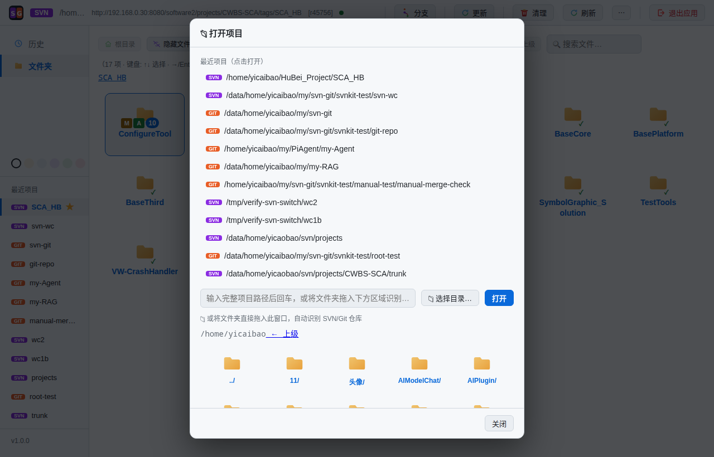
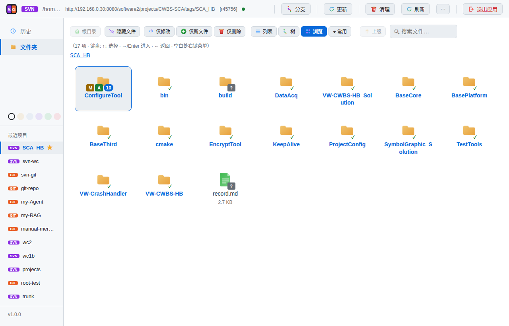
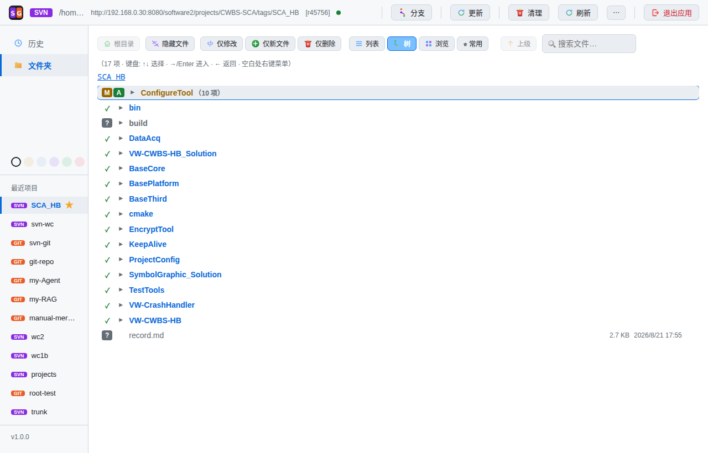
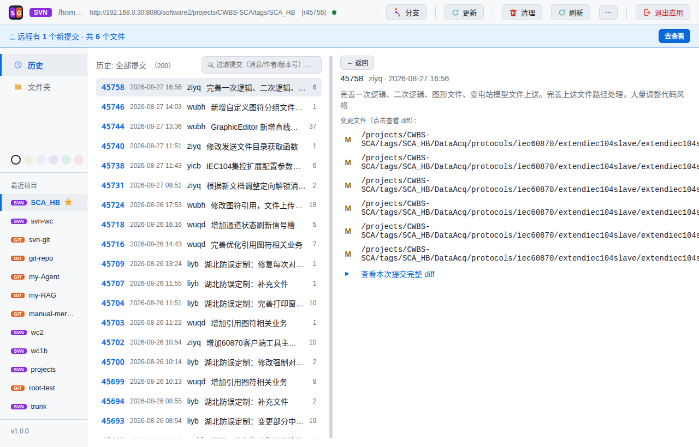
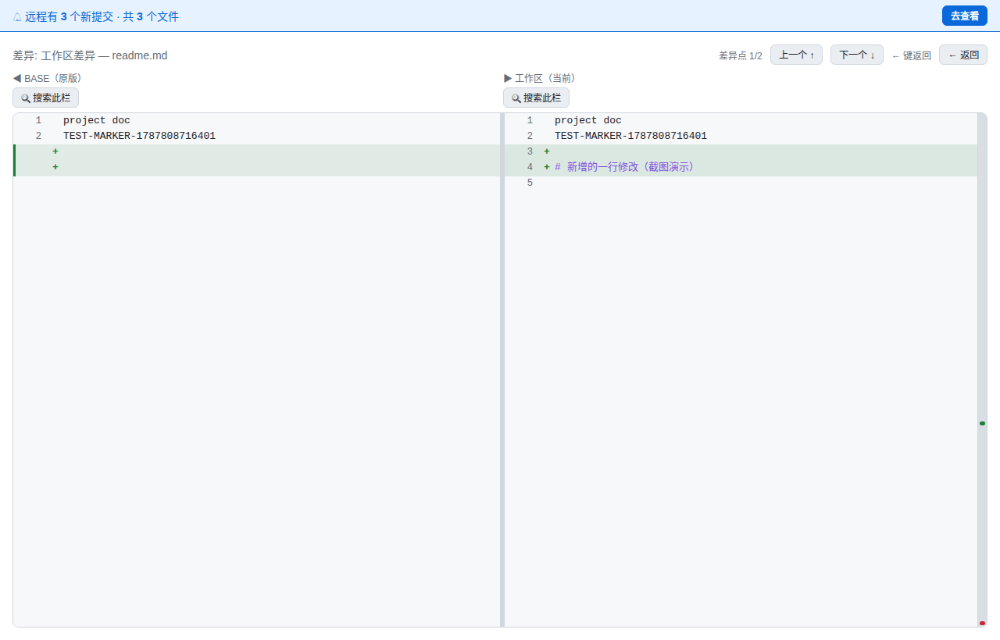
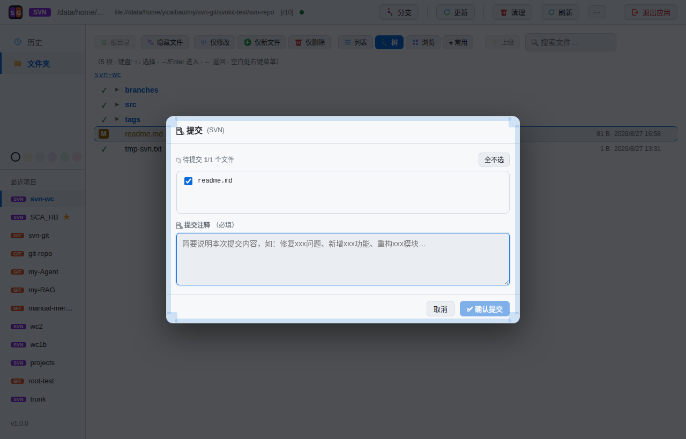
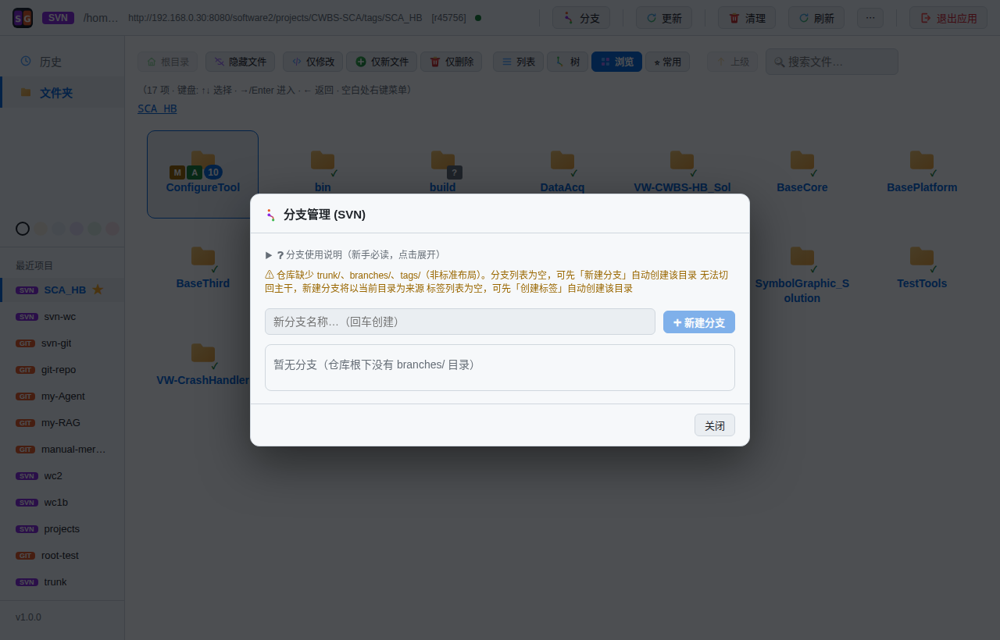
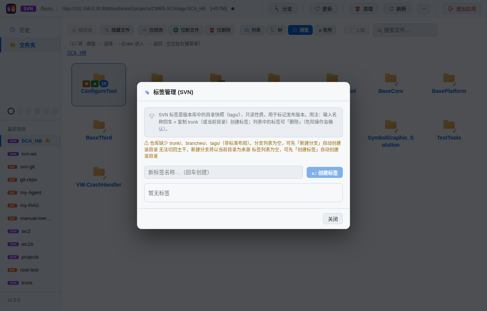

# SVN 使用说明

> 本文介绍如何用 **svn-git 文件版本管理** 工具日常管理 SVN 仓库:打开项目、查看状态、提交、分支、锁定、清理。
> 使用 Git 仓库请阅读 [Git 使用说明](usage-git.md),两篇结构一致,可以对照阅读。

## 目录

1. [打开项目](#打开项目)
2. [界面布局与三种视图](#界面布局与三种视图)
3. [状态徽标含义](#状态徽标含义)
4. [查看历史与差异](#查看历史与差异)
5. [修改与提交](#修改与提交)
6. [分支与标签](#分支与标签)
7. [SVN 特有功能](#svn-特有功能)
8. [冲突处理](#冲突处理)
9. [多选批量操作](#多选批量操作)
10. [重命名 / 移动](#重命名--移动)
11. [常见问题](#常见问题)

---

## 打开项目

启动工具后,默认进入"打开项目"界面(已打开仓库时,点顶部工具栏「⋯」→「打开项目」可随时打开)。与 Git 一样,可以输入路径、目录浏览或拖拽文件夹:

- **输入路径**:输入工作副本目录后回车,自动识别 SVN 仓库
- **目录浏览**:逐级点进目录,浏览到工作副本时,界面会显示识别卡片(紫色 SVN 徽标 + "进入此仓库 →"),点击进入

> 提示:SVN 打开的是**工作副本**(含有 `.svn` 目录的检出目录),而不是版本库(`svnadmin create` 的 db 目录)。两者在界面上一眼可辨:识别卡片会标明 "SVN/Git 工作副本"。

进入后顶部显示仓库地址(如 `file:///data/.../svn-repo`)、当前版本号(如 `r15`)和当前目录;左侧「最近项目」记录打开过的仓库,点击直达(右键可删除或设为常用项目,带 ★ 的常用项目在启动时优先打开)。

---

## 界面布局与三种视图

界面结构与 Git 版一致:左侧边栏(历史 / 文件夹)、顶部工具栏、中间主区。SVN 模式下工具栏为:仓库信息、**更新、清理、分支**、刷新、「⋯」更多(打开项目 / 新建仓库 / 标签 / 字体设置 / **SVN 登录**)、退出应用(没有 Git 的拉取/推送/Stash)。

主区左上角提供 **列表 / 树 / 浏览** 三种视图:

| 视图 | 特点 | 适合场景 |
|---|---|---|
| 浏览(默认) | 图标网格,状态角标 + 目录变更数量 | 日常查看状态 |
| 树 | 完整目录树,展开/收起 | 快速定位文件 |
| 列表 | 表格行,带操作按钮 | 批量处理文件 |

三种视图都支持:

- **过滤**:「仅修改」「仅新文件」「仅删除」可多选组合;过滤后主区切换为**过滤树**(目录自动聚合),**双击文件直接跳转**到该文件所在目录并选中(带面包屑点亮动画)
- **文件搜索**(自动定位)、**键盘导航**(`↑` `↓` 选择、`←` `Enter` 进入/返回)、右键上下文菜单
- **右键菜单**:按文件状态动态生成可用操作(查看差异/提交/还原/重命名/锁定/解锁/从版本库移除/查看历史/加入忽略等),**悬浮任意菜单项或按钮会显示将执行的真实命令**
- 工具栏「⭐ 常用」:管理**常用文件夹**——右键文件夹「加入常用文件夹(预加载缓存)」后,该目录下所有子目录会在后台递归预加载,之后点击秒开(本机保存,适合大仓库里常看的目录)

---

## 状态徽标含义

文件(或文件夹)角标上的字母表示其版本状态,与 `svn status` 一致:

| 徽标 | 含义 | 说明 |
|---|---|---|
| **M** 黄 | 已修改 | 内容与版本库不同 |
| **A** 绿 | 已添加 | 已 `svn add` 的新文件,尚未提交 |
| **D** 红 | 已删除 | 已 `svn delete`,尚未提交 |
| **?** 灰 | 未版本化 | 新建文件,从未加入版本库 |
| **!** 紫 | 缺失 | 版本化的文件不见了(如被其他程序删除) |
| **C** 红底 | 冲突 | 更新/合并产生冲突,需处理 |
| **R** 绿 | 已替换/重命名 | 被 `svn move` 改名,尚未提交 |
| **X** | 外部引用 | 由 svn:externals 拉取的内容 |
| **I** | 已忽略 | 被 svn:ignore 规则匹配 |

文件夹角标聚合子目录变更并显示数量。`?` 文件不参与提交,需先右键"添加到版本库";`!` 缺失文件右键「更新」即可恢复。

---

## 查看历史与差异

### 历史记录

点击左侧边栏「历史」,展示版本库全部提交:

- 顶部显示**提交总数**(如「历史: 全部提交(25)」),支持按消息/作者/版本号**模糊过滤**
- 每条提交显示:版本号(如 `r15`)、作者、时间、提交说明、变更文件数
- 点击某条提交,右侧显示变更文件列表,可跳转查看该版本的差异
- 从文件视图右键"查看历史",可只看某个文件/目录的历史

### 差异对比

在浏览视图中**双击任一修改(M)文件**,进入并排差异对比界面:

- **左右双栏**:左栏"原版"、右栏"工作区",修改行 M 标记高亮
- **滚动条预览**:绿(新增)红(删除)点全局分布
- **点击跳转**:点击任一栏修改处,另一栏自动滚动到对应位置
- **拖动分隔栏**:中间分隔栏可左右拖动(15%–85%)
- **独立搜索**:左右栏各自搜索框,分别定位栏内代码
- **语法高亮**:C/C++、Python、JS/TS 等 11 种语言

---

## 修改与提交

1. 修改文件后回到工具点「刷新」,文件角标变为 **M**
2. 在浏览视图**空白处右键 → 「提交修改的文件…」**,打开勾选式提交弹窗:

提交弹窗要点:

- **勾选文件**:默认全选,可取消勾选;一键全选/全不选
- **提交注释(必填)**:如"修复登录超时问题"
- **二次确认**:点击「✅ 提交勾选的 N 个文件」后还会确认一次
- `?` 未版本化文件不进入提交列表(需先"添加到版本库");`!` 缺失文件会以删除的形式一并提交
- 弹窗标题栏悬浮会显示将执行的 `svn commit` 命令

提交成功后提示版本号(如 `提交成功 r16`)。

---

## 分支与标签

SVN 的分支/标签本质是**版本库里的目录复制**(`branches/xxx`、`tags/xxx`),工具帮你把这条命令链封装成弹窗操作。默认在 trunk 上开发;若仓库不是标准布局(没有 trunk/branches/tags),弹窗顶部会显示**布局提示**。

### 分支管理

点顶部工具栏「分支」打开分支管理弹窗(顶部有"分支使用说明"折叠块):

- **创建**:输入分支名回车,自动把当前内容(trunk 或当前目录)复制为 `branches/新名称`(branches/ 目录不存在时自动创建)
- **切换**:点「切换」把工作副本指向该分支(等同 `svn switch`);当前在分支上时,可点「↩ 切回主干」一键回 trunk。切换前自动检查本地改动数量,建议先提交
- **合并**:把该分支的改动并入当前工作副本。合并前自动预检:工作副本落后于仓库(outdated)会拦截,要求先更新;本地有改动会提示可能冲突
- **删除**:删除 `branches/` 下的分支目录(主干 trunk 保护不可删)

> SVN 的分支删除本身就是远程删除(删除的是版本库里的目录),没有 Git 那样的"本地/远程"之分。

### 标签

点「⋯」→「标签」打开标签管理弹窗,输入名称回车即在当前版本创建标签(复制为 `tags/名称`);支持删除。发布版本时的里程碑标记常用它。

---

## SVN 特有功能

### 锁定 / 解锁

SVN 独有的文件锁,适合"这个文件我正改着,别让别人动":

- 右键文件 →「锁定」,文件角标旁出现锁图标;文件行内也有锁定/解锁按钮
- 其他同事的工具里会看到"被他人锁定"的提示,无法提交该文件
- 改完后右键 →「解锁」
- 注意:锁是**按文件**的,锁定前请确认自己真的要独占它;解锁时会询问是否保留本地修改

### svn:ignore 忽略

临时文件、构建产物不想进入版本库:

- 右键文件/目录 →「加入忽略…」,选择匹配模式(如 `*.log`)
- Git 版写 `.gitignore`,SVN 版等价于设置 `svn:ignore` 属性
- 被忽略的文件显示为普通图标(I),不再显示 `?` 打扰;右键「取消忽略」可移除规则

### 更新与 svn cleanup

- 工具栏「更新」执行 `svn update`(可取消);「清理」执行 `svn cleanup`,适合上次操作中断后工作副本报"locked"错误时
- 空白处右键「更新当前目录」更新整个仓库;更新后弹出**结果详情弹窗**:
  - 终端式状态字母文件列表(逐文件显示 U/A/D/R 等)
  - 按状态统计 + 当前版本号提示(如 `更新到 r20`)
  - SVN 警告完整展示,不会悄悄吞掉

### 外部定义(externals)自动处理

仓库配置了 `svn:externals`(外部引用,如引用的公共库目录)时,更新可能遇到外部定义失败(错误码 E205011,通常是外部地址不可达或无权限):

- 工具检测到 E205011 后,**自动改用 `--ignore-externals` 重试一次**,先更新普通文件,外部目录跳过,不影响整体更新
- 外部定义失败的警告会**完整展示在更新结果弹窗**里,并标注"已跳过外部引用",不会假装成功
- 想恢复外部目录时,单独对该目录执行更新即可

### SVN 登录

「⋯」→「SVN 登录」管理登录凭据:首次登录填写账号密码(工具保存到本地配置,权限 600);再次打开显示当前账号,可「🔄 切换账号」或「🚪 退出登录」(退出后改用 svn 官方凭据缓存)。密码通过 `--password-from-stdin` 传入 svn 命令,进程列表(ps)中不可见。

---

## 冲突处理

SVN 的冲突防护与 Git 版一样完整:

1. **行级冲突检测**:提交时精确比对,修改行与服务器版本重叠则**强制拦截**,提示"哪个文件第几行冲突"并给出处理指引(备份 → 删除 → 更新 → 手动合并)
2. **服务器更新交集提示**:服务器有新提交且与你的待提交文件有交集时,弹窗列出可能冲突文件(双击查看差异),可先更新
3. **2 分钟主动监控**:你修改的文件被他人先提交 → 警示条 +「查看对比」
4. **三方冲突解决器**:文件状态 C 时从顶部「解决冲突」进入,基础/本地/对方三栏对比(本地 = `.mine` 文件,对方 = `.r` 版本),可一键采用本地或对方版本,也可手动编辑后解决

更新时若产生真实冲突(状态 C),先看更新结果弹窗里的冲突文件列表,再用三方解决器逐文件处理,最后提交。

---

## 多选批量操作

与 Git 版一致:

- **浏览(网格)**:拖拽矩形框选 / Ctrl 点选
- **列表 / 树**:Ctrl+Shift 范围选择
- 选中后**右键**,菜单按选中集合的**操作能力分组**(各自带计数):
  - 「添加到版本库(N 项)」——只作用于 ? 未版本化文件
  - 「提交修改(N 项)…」「还原(N 项)」——只作用于 M/A/D/R/C 文件;还原按状态**动态命名**:全部 A 显示「取消添加(N 项)」、全部 D 显示「恢复删除(N 项)」
  - 「从版本库移除(N 项)」——本地保留,仅移出版本控制(`svn delete --keep-local`)
  - 「删除磁盘文件(N 项)」——未版本化文件的彻底删除
  - 「复制完整路径(N 项)」
- 混选时工具自动拆分到对应分组,不误伤(如"提交"只作用于 M/A/D,"添加"只作用于 ?)

---

## 重命名 / 移动

右键文件或文件夹 →「重命名」,弹窗只需输入**新名字**(自动保留原目录):

- **版本化文件**:执行 `svn move`,磁盘立即改名并调度为"删除旧名 + 添加新名"(提交后生效);弹窗确认按钮会显示将执行的完整命令
- **未版本化(?)/ 被忽略(I)文件**:直接**磁盘改名**,不影响版本库

> 已删除(D)或调度中的文件不可重命名;重命名命令需在新名字弹窗中确认后才会执行。

---

## 常见问题

**Q1:工作副本提示"locked",无法更新/提交?**

上次操作被中断导致的。点工具栏「清理」(svn cleanup)即可解除,再执行更新。

**Q2:文件显示 !(缺失),怎么办?**

文件被其他程序删掉了。右键 →「更新」或更新整个目录,缺失文件会恢复;如果是有意删除,右键「提交此文件」把它从版本库删除。

**Q3:更新提示外部定义失败(E205011)?**

工具已自动跳过外部引用并更新了其他文件,警告会在结果弹窗完整展示。确认外部地址可用后,再对外部目录单独更新即可恢复。

**Q4:提交时提示文件被他人锁定?**

说明该文件被其他同事锁定了。联系对方解锁后再提交;如果是误报,可用 `svn cleanup` 后重试。

**Q5:新文件是 ? 状态,提交弹窗里没有?**

`?` = 未版本化,svn 不知道它要不要入库。右键 →「添加到版本库」,变 A 后再提交;不需要的就右键 →「加入忽略…」。

**Q6:切换分支后文件"不见了"?**

`svn switch` 会改变工作副本内容,这是正常现象。想回到主干,用分支弹窗的「↩ 切回主干」即可;切换前记得先提交或备份未提交的修改。

**Q7:登录 SVN 服务器总提示认证失败?**

点「⋯」→「SVN 登录」,确认已保存正确的账号密码(密码通过 stdin 传入,进程列表不可见);若服务器证书不受信任,在登录弹窗勾选"信任自签名证书"。

---

## 更多资源

- [Git 使用说明](usage-git.md):Git 仓库版的完整教程(Stash、推送、upstream 等)
- [架构文档](architecture.md):设计与实现细节
- [项目优势](advantages.md):与同类工具对比
- [项目主页](../README.md):快速开始与功能总览
